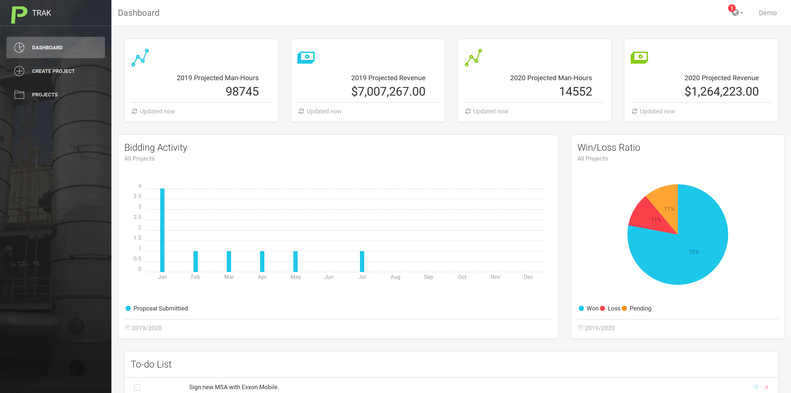

# ProjectTrak

#### Description

ProjectTrak is a project management application built with the MERN stack.

#### Features:

- View data charts/graphs for projected revenue/man-hours.
- Visualize monthly bidding activity.
- Visualize win/loss ratios.
- Create new projects and edit/delete existing projects.

#### Screenshot

Feel free to view/interact with the live demo.

Live URL: https://young-shelf-26898.herokuapp.com/#/dashboard
